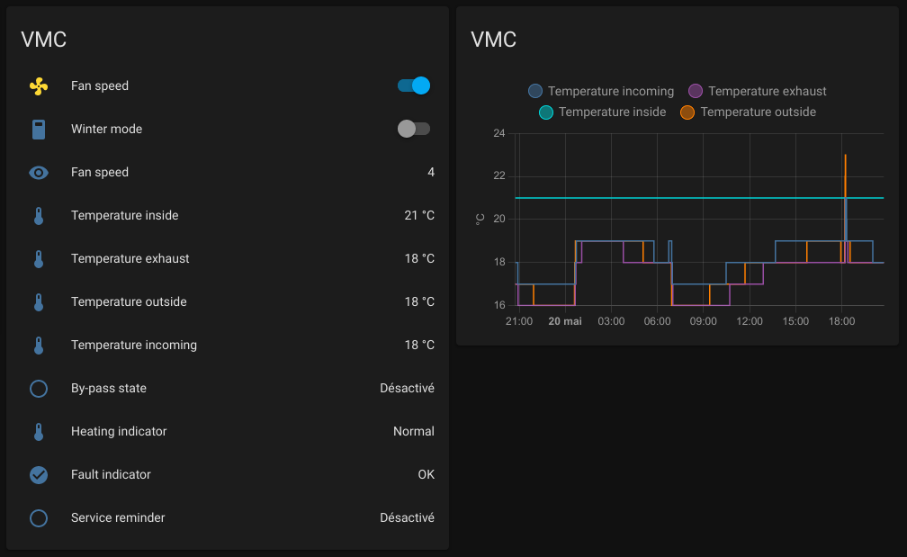

# ESPHome / Helios KWL

ESPHome integration for Helios KWL via RS485.

Of course, it all makes sense if integrated with the amazing Home Assistant:

## Introduction

I own since 2012 a Helios KWL EC 500 R. Back then, I checked for the KNX module that would allow me
to integrate the device into my home automation bus. However, the price was just crazy high. So
after so many years, I finally decided to hack it myself. I ordered a RS485 / UART adapter, sniffed
a few packets and actually found the documentation of the protocol online. I'm using a BEC to power
the ESP32 from the 24V of the KWL.

Newer version of the Helios product now have directly an Ethernet port and can be integrated more
easily. However, if you own an older model, this integration is for you.

I only implemented the features I use and find useful but more could be added.

## Wiring diagram

## Disclaimer

As usual, I decline all responsibility if you break your Helios KWL (or anything else
actually).

## Shopping list

These are examples of items required for this project. You will also need (silicone) wires and heat shrink tubing.

* RS485 adapter: https://www.aliexpress.com/item/32889414931.html
* Wemos D1 Mini ESP32: https://fr.aliexpress.com/item/32815738795.html (select D1 MINI ESP32)
* BEC 5V (input 24V): https://fr.aliexpress.com/item/1865193146.html

## Links

* Example datagrams: [helios-kwl.txt](docs/helios-kwl.txt)
* Protocol: https://wiki.fhem.de/w/images/7/7e/Digit_protocol_english_RS485.pdf
